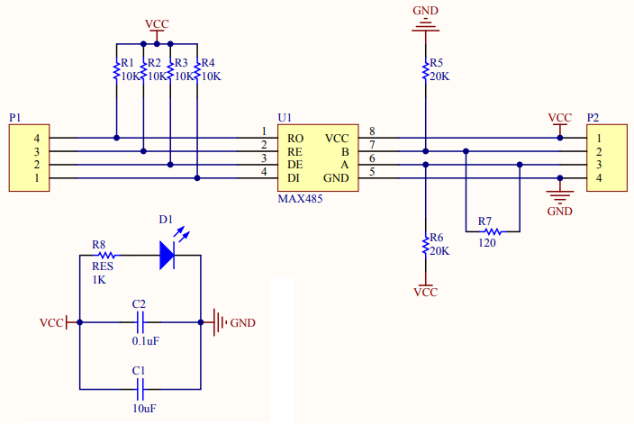

# ESP32 ArtNet to DMX Gateway

This project allows for receiving ArtNet messages via WIFI and transmitting ANSI-ESTA E1.11 DMX-512A using an Espressif ESP32. It is based on two libraries for ArtNet and DMX messaging which individually have a ton of configurability. By default this project will open up a WIFI configuration portal after a _double reset_ where the WIFI credentials and ArtNet Universe may be configured. The output circuitry has been texted with [MAX485 TTL UART to RS485](https://core-electronics.com.au/ttl-uart-to-rs485-converter-module.html) module along with MAX485 chips directly. 


Click the link below to see it in action

[](infinite.mp4 "Studio")


## Contents

- [Overview](#overview)
  - [Flow](#flow)
  - [Stack](#stack)
- [Prototype 1](#prototype-1)
- [Prototype 2](#prototype-2)
  - [Schematic](#schematic)
  - [PCB Layout](#pcb-layout)
  - [PCB Render](#pcb-render)
  - [Enclosure](#enclosure)
- [Library Installation](#library-installation)
  - [ArtNet](#artnet)
  - [ESP DMX](#esp-dmx)
  - [WIFI Manager](#wifi-manager)
- [Hardware](#hardware)
  - [UART Pins](#uart-pins)


## Overview


### Stack
Building on the ESP Core, this project can accept physical DMX connections (RJ45, XLR) along with connecting to WIFI to accept ArtNet messagse. Whilst it is possible to accept ArtNet broadcast messages, the reality of WIFI connections is that many packets are lost, hence it is recommended that UNICAST be configured for the upstream ArtNet controller.


### Flow

All incoming DMX messages are forwarded by default to the DMX Out port unless ArtNet messaging is being received, in which case Incoming DMX messages are dropped and the configured ArtNet universe messages are sent via the DMX Out port. The Gateway is configured to forward exactly one ArtNet universe to the DMX Output port. A Universe ID is configured as part of the WIFI setup, by default Universe 1 is configured.


## Prototype 1

The proto board uses off the shelf modules to enable RS485 (DMX) communication between devices, though you can use the MAX485 chip directly


## Prototype 2

A second version of the board created use EasyEDA and Fusion 360

### Schematic


### PCB Layout


### PCB Render


### Enclosure


## Library Installation

This project requires the Arduino-ESP32 framework version 2.0.0 or newer. To install the correct framework, follow Espressif's instructions on the Arduino-ESP32 documentation page [here](https://docs.espressif.com/projects/arduino-esp32/en/latest/installing.html).

### ArtNet

This project uses [ArtnetWifi](https://github.com/rstephan/ArtnetWifi) from Stephan Ruloff as the means to receive ArtNet packets

Tested with 1.4.0 -- Install this via Arduino Library Manager


### ESP DMX

This project uses [esp_dmx](https://github.com/someweisguy/esp_dmx) from Mitch Weisbrod as the means to transmit and receive DMX messages

Tested with 1.1.3 -- Install this via Arduino Library Manager


### WIFI Manager

This project uses [ESP Async WIFI Manager](https://github.com/khoih-prog/ESPAsync_WiFiManager) from Khoi Hoangx as the means to configure WIFI credentials

Tested with 1.12.0 -- Install this via Arduino Library Manager

## Hardware

RS485 to TTL UART is performed by the MAX485 (or similar) IC. Wired as follows. UART 2 on the ESP is used for communications on the default pins. This can be changed to any available UART if required, note that the ESP32 has the ability to remap UART pins to any GPIO, with the esp_dmx library providing a function to set the pins. 

Note that if this is setup to transmit DMX messages only, then RE, DE can simply be pulled low to GND

#### DMX Port - Output

Note receive is not connected in this case

| Function			  | ESP PIN       | MAX PIN 	|
| --------------- |:-------------:| ---------:|
| Transmit			  | 17			      | DI 		    |
| Transmit Enable	| 4 			      | RE 	     	|
| Receive Enable	| 4 			      | DE 	    	|
| Receive			    | NC (16)	      | RO 	     	|

#### DMX Port - Input

Note transmit is not connected in this case

| Function        | ESP PIN       | MAX PIN   |
| --------------- |:-------------:| ---------:|
| Transmit        | NC (19)       | DI        |
| Transmit Enable | 21            | RE        |
| Receive Enable  | 21            | DE        |
| Receive         | 18            | RO        |




### UART Pins

Use the esp_dmx function call to change the UART GPIO pins to non-standard pinouts

```
esp_err_t dmx_set_pin(dmx_port_t dmx_num, int tx_io_num, int rx_io_num, int rts_io_num)
```

Example:
```
dmx_port_t dmxPort = 2;
int transmitPin = 17;
int receivePin = 16;
int enablePin = 21;

dmx_set_pin(dmxPort, transmitPin, receivePin, enablePin);
```


